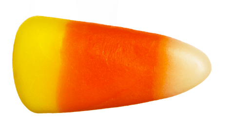
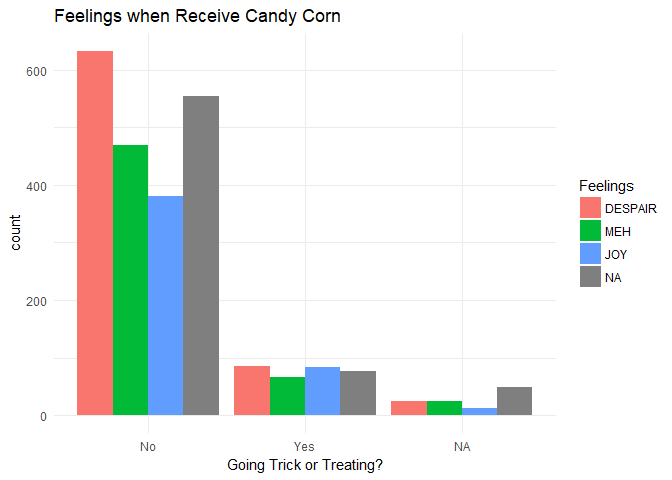

# Candy Hierarchy Data 2017:candy::lollipop::chocolate_bar:: Candy Corn

Thanks to David Ng (and Jenny Bryan @jennybc for sharing) at UBC publishing the [candy hierarchy data](http://www.scq.ubc.ca/so-much-candy-data-seriously/) from an online survey. Candy Corn, as the signature candy of Halloween, I have spent my life time (more realistically, maybe every October I have lived) trying to understand the reason that people like it because I really do not get it.

Interestingly, the Candy Corn debate was featured on [Vogue](https://www.vogue.com/article/candy-corn-love-hate) which has commented that 'there is no in-between for Candy Corn, you either love it or hate it' and I am curious to see if the survey data says the same.

# How do people feel about Candy Corn?
First and foremost, more people feel despair about Candy Corn than joy. 
And, no, we dont' see the same effect described by Vogue, since 22.8% people feel meh about Candy Corn.

# Is Circus Peanuts the Worst?
Second, [Candy Store](https://www.candystore.com/blog/holidays/halloween/definitive-ranking-best-worst-halloween-candies/) said the **worst** Halloween candy is Circus Peanuts (the second worst is Candy Corn). With the interesting options included in this survey (e.g., Broken glow stick?!), circus peanut is ranked #10 on % of Despair it receives.

# Should I Buy Candy Corn?
Last and maybe the most relevant to some of you, should you buy Candy Corn for people coming for trick and treating?
The short answer is up to you. It does not really matter to those who are going trick or treating.

# Happy Halloween! :jack_o_lantern::ghost: