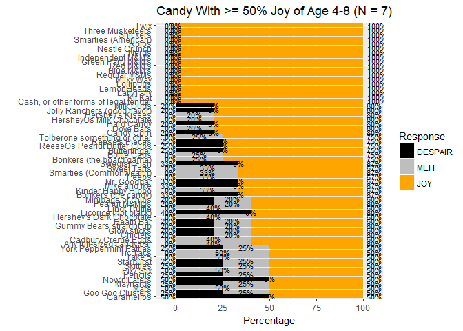
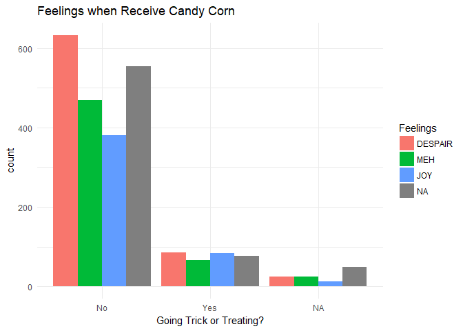

### Candy Hierarchy Data 2017: Candy Corn

Thanks to David Ng (and @jennybc for sharing) at UBC publishing the [candy hierarchy data](http://www.scq.ubc.ca/so-much-candy-data-seriously/). One candy really stood out to me that I'm interested to dig deeper of the data about it. Candy Corn, as the signature candy of Halloween, I have spent my life time (more realistically, probably every October I have lived) trying to understand the reason that people like it because I really do not get it.

I am glad to learn that I am not alone on this side of the candy corn debate as [Vogue](https://www.vogue.com/article/candy-corn-love-hate) pointed out many other Twitter users are with me. Vogue has also further commented that 'there is no in-between for Candy Corn, you either love it or hate it', we will see if the survey data says the same.

Now, let's (data) wrangle!

Loading Packages and Reading in Data
------------------------------------

``` r
library(tidyverse)
library(stringr)
library(jpeg)
library(grid)
# devtools::install_github('jbryer/likert')
library(likert)
library(reshape2)

img <- readJPEG("1468620.jpg") #Candy Corn background from clipart library
data_orig <- read_csv("candyhierarchy2017.csv")
data      <- data_orig

# Clean candy names
colnames(data) <- colnames(data) %>%
  iconv(to = "ASCII//TRANSLIT") %>% #convert for special characters
  str_replace_all(c("\\\\xd5" = "",
                    "Q6 \\| |Q\\d{1,2}\\: " = "",
                    "\\?\\?" = "")) %>%
  str_trunc(39, side="right")
# Re-order levels of Candy Corn for future plotting purposes
data$`Candy Corn` <- factor(data$`Candy Corn`, levels = c("DESPAIR", "MEH","JOY", NA))
```

Feelings when Receive Candy Corn
--------------------------------

First, more people feel despair about candy corn than joy. NA means they left the question blank which can mean "they don't know the candy" as instructured in the survey or they skipped this option/question.


Now, let's look at these in percentages.

``` r
cc_pert <- table(data$`Candy Corn`, useNA = "ifany") %>%
  prop.table() %>% #ignoring NAs
  data.frame()
stderror <- function(p) {qnorm(.975) * sqrt(p * (1-p) / length(data$`Candy Corn`))} #95% CI
cc_pert$se <- sapply(cc_pert$Freq, stderror)

g <- ggplot(cc_pert, aes(x = Var1, y = Freq))
g + annotation_custom(rasterGrob(img, width=unit(1,"npc"), height=unit(1,"npc")), 
                      -Inf, Inf, -Inf, Inf) +
  geom_col(fill = "#ffdb99") +
  geom_errorbar(data=cc_pert, aes(ymin = Freq-se, ymax = Freq+se), width = 0.15, color = "dark grey") +
  geom_text(label = round(cc_pert$Freq, 3) * 100) +
  scale_y_continuous(labels = scales::percent) +
  labs(title = "Feelings when Receive Candy Corn", x = "Feelings", y = "", 
       subtitle = "With 95% Confidence Interval") +
  theme_minimal()
```


30.2% feel Despair if they receive candy corn, while only 19.4% feel joy. Surprisingly, 27.6% did not respond to the question, I am curious to know if they truly do not know what Candy Corn is, or if they decided to skip the question. Unfortunately, there is no way I can differentiate the two from the data.

However, we also see that 22.8% of respondents feel 'meh' about it, therefore, we did not see what [Vogue](https://www.vogue.com/article/candy-corn-love-hate) said 'no one feels "meh" about it' in our survey data.

Likert Plot
-----------

Traditionaly, these data are usually plotted on a "Net Feelies" metric (=\#JOY-\#DESPAIR). Using likert plot can allow us to also take a look at the neutral option (meh).

``` r
candy <- data[, substr(colnames(data_orig), 1, 2) == "Q6"] #use index from orig data
candy2 <- candy %>%
  data.frame() %>%
  unclass() %>%
  as.data.frame()
lvls <- c("DESPAIR", "MEH","JOY", NA)
candy2[] <-  lapply(candy2, factor, levels=lvls)
colnames(candy2) <- colnames(data)[grep("Q6", colnames(data_orig))]

likert_plot <- likert(candy2)

p <- plot(likert_plot, colors = c("black", "grey", "orange")) + # change to Halloween color
  ggtitle(paste0("Candy Preference of N = ", nrow(candy2)))
print(p)
```


Wow, there are a lot of candies/x-axis labels on this plot. In the likert package, there is no option/argument given to shorten the plot, and it requires some re-engineering of the function as shown below in order to shorten the plot.

Candies that Receive &gt;= 50% Joy
==================================

``` r
# Re-engineer likert plot
# create summary table
table_summary <- likert(candy2)

# reshape results
results_50 <- table_summary$results %>% 
  filter(JOY >= 50) # Filter to 50% JOY
results <- melt(results_50, id.vars='Item')
results$Item <- factor(results_50$Item, levels = results_50$Item[order(results_50$JOY)]) #Sort bars from highest Joy

lsum <- summary(table_summary, center = (table_summary$nlevels-1)/2 + 1) %>%
  filter(high >= 50)
lsum$y <- lsum$low + (lsum$neutral/2)
# some defaults
ymin = 0
text.size = 3

ggplot(results, aes(y=value, x=Item, group=Item)) + 
  geom_bar(stat='identity', aes(fill=variable)) + 
  ylim(c(-5,105)) + 
  coord_flip() +
  scale_fill_manual('Response', values=c("black", "grey", "orange"), 
              breaks=levels(results$variable), 
              labels=levels(results$variable)) +
  geom_text(data=lsum, y=ymin, aes(x=Item, 
              label=paste(round(low), '%', sep='')), 
              size=text.size, hjust=1) +
  geom_text(data=lsum, y=100, aes(x=Item,
              label=paste(round(high), '%', sep='')), 
              size=text.size, hjust=-.2) +
  geom_text(data=lsum, aes(x=Item, y=y,
                                   label=paste0(round(neutral), '%')),
                                   size=text.size, hjust=.5) +
  labs(x = "", y = "Percentage", title = "Candy With >= 50% Joy")
```


Candies Receiving Least % (&lt;= 11%) of Joy
============================================


Besides looking at % of joy, % of despair is another important metric to be considered.

According to [Candy Store](https://www.candystore.com/blog/holidays/halloween/definitive-ranking-best-worst-halloween-candies/), the **worst** Halloween candy is Circus Peanuts (the second worst is Candy Corn). Circus Peanuts has received 73% Despair and 11% Joy in this survey data.

Let's see where circus peanut is on the list, among other candies that receive high percentage of despair.

Candies that Receive Highest % of Despair
=========================================

``` r
# Re-engineer likert plot
# create summary table
table_summary <- likert(candy2)

# reshape results
results_50 <- table_summary$results %>% 
  filter(DESPAIR >= 50) # Filter to 50% JOY
results <- melt(results_50, id.vars='Item')
results$Item <- factor(results_50$Item, levels = results_50$Item[order(results_50$DESPAIR)]) #Sort bars from highest Joy

lsum <- summary(table_summary, center = (table_summary$nlevels-1)/2 + 1) %>%
  filter(low >= 50)
lsum$y <- lsum$low + (lsum$neutral/2)
# some defaults
ymin = 0
text.size = 3

ggplot(results, aes(y=value, x=Item, group=Item)) + 
  geom_bar(stat='identity', aes(fill=variable)) + 
  ylim(c(-5,105)) + 
  coord_flip() +
  scale_fill_manual('Response', values=c("black", "grey", "orange"), 
              breaks=levels(results$variable), 
              labels=levels(results$variable)) +
  geom_text(data=lsum, y=ymin, aes(x=Item, 
              label=paste(round(low), '%', sep='')), 
              size=text.size, hjust=1) +
  geom_text(data=lsum, y=100, aes(x=Item,
              label=paste(round(high), '%', sep='')), 
              size=text.size, hjust=-.2) +
  geom_text(data=lsum, aes(x=Item, y=y,
                                   label=paste0(round(neutral), '%')),
                                   size=text.size, hjust=.5) +
  labs(x = "", y = "Percentage", title = "Candy With >= 50% Despair")
```


With the interesting options included in this survey (e.g., Broken glow stick?!), circus peanut is ranked \#10 on % of Despair it receives.

The likert package also provides a look at the missing data for each candy item.

``` r
plot(likert_plot, colors = c("black", "grey", "orange"), include.histogram = TRUE)
```


Likert Plot by Age
------------------

It could also be interesting to see if there is a difference in candy preference between age groups.

First, we will clean up the age column by binning them.

``` r
# First, clean up age
data$age2 <- as.numeric(data$AGE)
# table(data$age2) #age 1, 312, 1000 and 39.4
data$age2[which(data$age2 >= 100 | data$age2 <= 1)] <- NA
# Second, bin age
agebreaks <- c(4, 9, 13, 18, 25, 35, 45, Inf)
agelabels <- c("4-8","9-12", "13-17", "18-24", "25-34", "35-44", "45+")
data$agebin <- cut(data$age2, breaks = agebreaks, right = FALSE, labels = agelabels)
```

Now, we are ready to plot!

``` r
# Likert plot by age
plot_age <- function(candyage, agebin){
  candyage <- candyage %>%
    select(c(7:109)) %>%
    data.frame() %>%
    unclass() %>%
    as.data.frame()
  lvls <- c("DESPAIR", "MEH","JOY", NA)
  candyage[] <-  lapply(candyage, factor, levels=lvls)
  colnames(candyage) <- colnames(data)[grep("Q6", colnames(data_orig))]
  
  likert_plot_age4 <- likert(candyage)
  
  # reshape results
  table_summary <- likert_plot_age4
  results_50 <- table_summary$results %>% 
    filter(JOY >= 50) # Filter to 50% JOY
  results <- melt(results_50, id.vars='Item')
  results$Item <- factor(results_50$Item, levels = results_50$Item[order(results_50$JOY)]) #Sort bars from highest Joy
  
  lsum <- summary(table_summary, center = (table_summary$nlevels-1)/2 + 1) %>%
    filter(high >= 50)
  lsum$y <- lsum$low + (lsum$neutral/2)
  # some defaults
  ymin = 0
  text.size = 3
  
  p <- ggplot(results, aes(y=value, x=Item, group=Item)) + 
    geom_bar(stat='identity', aes(fill=variable)) + 
    ylim(c(-5,105)) + 
    coord_flip() +
    scale_fill_manual('Response', values=c("black", "grey", "orange"), 
                      breaks=levels(results$variable), 
                      labels=levels(results$variable)) +
    geom_text(data=lsum, y=ymin, aes(x=Item, 
                                     label=paste(round(low), '%', sep='')), 
              size=text.size, hjust=1) +
    geom_text(data=lsum, y=100, aes(x=Item,
                                    label=paste(round(high), '%', sep='')), 
              size=text.size, hjust=-.2) +
    geom_text(data=lsum, aes(x=Item, y=y,
                             label=paste0(round(neutral), '%')),
              size=text.size, hjust=.5) +
    labs(x = "", y = "Percentage", 
         title = paste0("Candy With >= 50% Joy of Age ", agebin, " (N = ", nrow(candyage), ")"))
  print(p)
  # print(plot(likert_plot_age4, colors = c("black", "grey", "orange")) + 
  #         ggtitle(paste0("Candy Preference of Age ", agebin)))  
}
# sapply(levels(data$agebin), plot_age) %>% invisible()
```



Here are some more plots I have for the purpose of exploratory data analysis.

Should I give Candy Corn out on Trick or Treat?
===============================================

Up to you, it does not really matter to those who are going trick or treating.

``` r
# Plot: Candy Corn and Going Out
ggplot(data, aes(x = factor(`GOING OUT?`), fill = factor(`Candy Corn`))) +
  geom_bar(na.rm = TRUE, position = position_dodge()) + 
  labs(title = "Feelings when Receive Candy Corn", x = "Going Trick or Treating?") +
  guides(fill=guide_legend(title="Feelings")) +
  theme_minimal()
```



``` r
# Plot: Candy Corn and Age
ggplot(data, aes(x = factor(agebin), fill = factor(`Candy Corn`))) +
  geom_bar(na.rm = TRUE, position = position_dodge()) + 
  labs(title = "Feelings when Receive Candy Corn", x = "Age") +
  guides(fill=guide_legend(title="Feelings")) +
  theme_minimal()
```


